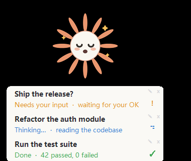

# Claude 桌面宠物 · Claude Desktop Pet · Claude デスクトップペット

🌸 一只住在桌面、帮你盯 Claude Code 进度的小宠物。
A little desktop mascot that watches your Claude Code progress for you.
Claude Code の進捗を見守る、デスクトップの小さなマスコット。

<p align="center"></p>

**语言 / Language / 言語:** [中文](#中文) ・ [English](#english) ・ [日本語](#日本語)

> ⚠️ 非官方社区项目,与 Anthropic 无关 / Unofficial community project, not affiliated with Anthropic / 非公式のコミュニティ製。Anthropic とは無関係です
> 给改代码的人 / Developers / 開発者 → `MAINTAINERS.md`

---

## 中文

### 这是什么?
一只待在你 Windows 桌面上的小宠物。它盯着你正在跑的 Claude Code 对话,用**卡片**和**轻提示音**告诉你:Claude 是在**思考**、在**等你做选择**、还是**已经做完了**——这样你不用一直盯着命令行窗口。

### 安装
**需要:** Windows ・ Claude Code ・ **PowerShell 7**(命令 `pwsh`;没有就 `winget install Microsoft.PowerShell`,或到 Microsoft Store 搜 "PowerShell" 安装)

在 Claude Code 里输入两条命令——Claude 会**直接从 GitHub 拉取**,不用手动下载:
```
/plugin marketplace add shin620265/claude-pet
/plugin install claude-pet@shin620265
```
然后运行 **`/reload-plugins`** 让它在当前会话生效(**首次安装也要这步**;无需重启、不丢终端标签。或者开一个新的 Claude 会话,它也会自动生效)。

完成!用 `/my-pet` 打开宠物(之后会记住,新会话自动出现)。
**卸载:** `/plugin uninstall claude-pet@shin620265`(想彻底清理,再删除 `~/.claude/pet-data` 文件夹——存的是设置与卡片记忆)

> 已经把仓库 clone / 下载到本地了?把第一条换成 `/plugin marketplace add <本地文件夹路径>` 即可,其余不变。

### 你会看到什么?
- 桌面上一个小角色(Claude 星芒)。
- 有对话在跑时,旁边叠出**状态卡**(最多 3 张),每张显示:
  - **标题** = 你在那个对话里说的第一句话。
  - **状态行** = 当前状态 + 你最近一句输入,带颜色和图标:
    - 🔵 正在思考(转圈)・ 🟡 需要你确认/选择(**!**,自动置顶)・ 🟢 已完成(**✓**)・ ⚪ 空闲

### 怎么用
1. **开/关**:在 Claude Code 里输入 `/my-pet`(会记住;下次开 Claude 自动出现,全部关掉后消失)。
2. **看提示**:平时不用管它;Claude 做完或需要你选择时会响一声 + 卡片亮起对应状态。
3. **操作**:拖动=移动(记忆位置);双击=收起/展开卡片;每行 **✎**=改标题、**×**=关掉这张卡(有新动静会自己回来);**右键**=菜单(关闭宠物/回默认位置/提示音/语言)。

### 设置
- **语言**:右键 →「语言」→ 中文/English/日本語/自动(自动=跟随系统),点一下即时切换。
- **提示音**:右键 →「提示音」开/关。
- **自动安静**:全屏游戏、演示、或开了"专注助手/勿扰"时不出声(卡片照常更新)。
- **减少动画**:在 设置 → 辅助功能 → 视觉效果 →「动画效果」关掉后,宠物不再浮动/眨眼,转圈变静止「…」。

### 更新到新版本
在 Claude Code 里**依次**输入这四条(`install` 时选 user scope):
```
/plugin marketplace update shin620265
/plugin uninstall claude-pet@shin620265
/plugin install claude-pet@shin620265
/reload-plugins
```
这样**当前会话**就用上新版了。

⚠️ **其它已经开着的会话仍是旧版**。想让它们也更新,任选:
- 在那个会话里也跑一次 `/reload-plugins`;
- 或**关掉它的终端标签,再 `claude --resume <会话id>` 打开**(保留对话,新进程一定加载最新版);
- 新开的会话自动就是新版,无需操作。

### 已知限制
- **点卡片不能跳到对应会话**(最常见疑问):Windows Terminal / VS Code 的标签页没有可靠 API 可被外部定位,宠物做不到点一下切到那个 tab——卡片只负责告诉你"哪个会话、什么状态"。
- **仅 Windows**(用 `powershell.exe` + WinForms)。
- **原生 GUI 聊天面板可能不出卡**:在终端里跑 Claude Code 一定可用;扩展的图形聊天面板若不触发钩子/不产生 `claude.exe`,该会话可能不出卡(不影响其它终端会话)。
- **卡片名与终端标签名不自动同步**:卡片标题默认取你的第一句话,与终端标签名各自独立。想让它俩一致,**点卡片行上的 ✎ 手动改名**即可(改完会锁定,不被自动覆盖)。
- **同屏最多 3 张卡**:其余会话静默跟踪,等"需确认"或最近活跃时才浮现。
- **混合 DPI 多屏**:界面缩放按主屏 DPI 计算;把宠物拖到缩放比例不同的副屏时,字号可能略偏大/偏小。

### 常见问题
- **没看到宠物?** 输入 `/my-pet` 打开;还没有就确认 Claude Code 在运行。
- **没声音?** 看右键「提示音」是否开着,且不在全屏/勿扰状态。
- **哪个终端都能用?** 能:VS Code 终端、Windows Terminal、PowerShell 窗口都一样。

---

## English

### What is this?
A little mascot that lives on your Windows desktop. It watches your running Claude Code conversations and tells you — with **cards** and a **soft chime** — whether Claude is **thinking**, **waiting for your choice**, or **done**. So you don't have to keep staring at the terminal.

### Install
**Requires:** Windows ・ Claude Code ・ **PowerShell 7** (the `pwsh` command; if you don't have it: `winget install Microsoft.PowerShell`, or install "PowerShell" from the Microsoft Store)

In Claude Code, run two commands — Claude fetches it **straight from GitHub**, no manual download:
```
/plugin marketplace add shin620265/claude-pet
/plugin install claude-pet@shin620265
```
Then run **`/reload-plugins`** to activate it in your current session (**needed on first install too**; no restart, keeps your terminals — or just start a new Claude session and it activates automatically).

Done — open the pet with `/my-pet` (it remembers, and appears automatically in new sessions).
**Uninstall:** `/plugin uninstall claude-pet@shin620265` (for a full cleanup, also delete the `~/.claude/pet-data` folder — it holds settings and card memory)

> Already cloned/downloaded the repo? Replace the first command with `/plugin marketplace add <path-to-the-local-folder>` — everything else is the same.

### What you'll see
- A small character on your desktop (the Claude spark).
- When conversations are running, **status cards** stack next to it (up to 3). Each card shows:
  - **Title** = the first thing you typed in that conversation.
  - **Status line** = current state + your latest message, with color and icon:
    - 🔵 Thinking (spinner) ・ 🟡 Needs your input (**!**, auto-floats to top) ・ 🟢 Done (**✓**) ・ ⚪ Idle

### How to use
1. **Open/close**: type `/my-pet` in Claude Code (it remembers; reappears next time you open Claude Code, disappears once all are closed).
2. **Just watch**: when Claude finishes or needs a choice, it chimes and the card lights up with the matching state.
3. **Actions**: drag = move (remembered); double-click = collapse/expand cards; per row **✎** = rename, **×** = dismiss (comes back on new activity); **right-click** = menu (close pet / reset position / sound / language).

### Settings
- **Language**: right-click → "Language" → 中文/English/日本語/Auto (Auto follows your system); switches instantly.
- **Sound**: right-click → "Sound" on/off.
- **Auto-quiet**: stays silent during fullscreen games, presentations, or Windows Focus Assist (cards still update).
- **Reduced motion**: turn off Settings → Accessibility → Visual effects → "Animation effects" and the pet stops bobbing/blinking; the spinner becomes a static "…".

### Updating
In Claude Code, run these **in order** (choose user scope for `install`):
```
/plugin marketplace update shin620265
/plugin uninstall claude-pet@shin620265
/plugin install claude-pet@shin620265
/reload-plugins
```
That updates the **current session**.

⚠️ **Other open sessions stay on the old version.** To update them, either:
- run `/reload-plugins` in that session too;
- or close its terminal tab and reopen with `claude --resume <session-id>` (keeps your conversation; a fresh process always loads the latest);
- new sessions get the latest automatically — nothing to do.

### Known limitations
- **Clicking a card does NOT jump to that conversation** (the most common question): there's no reliable API to focus a specific tab in Windows Terminal / VS Code, so the pet can't switch tabs for you — cards only tell you which session needs what.
- **Windows only** (uses `powershell.exe` + WinForms).
- **The native GUI chat panel may not show a card**: terminal-hosted Claude Code always works; the extension's GUI panel may not (if it doesn't fire hooks / spawn `claude.exe`). Other terminal sessions are unaffected.
- **Card name and terminal tab name don't auto-sync**: the card title defaults to your first prompt and is independent of the tab name. To make them match, **rename the card with the ✎ on its row** (the new name is locked and won't be overwritten).
- **At most 3 cards show at once**: other sessions are tracked silently and surface when they need you or become most-recent.
- **Mixed-DPI multi-monitor**: UI scale is computed from the primary monitor's DPI, so text may look slightly too large/small if you drag the pet to a monitor with a different scale factor.

### FAQ
- **Don't see the pet?** Type `/my-pet`. If still nothing, make sure Claude Code is running.
- **No sound?** Check right-click → "Sound" is on, and you're not in fullscreen / Do-Not-Disturb.
- **Works in any terminal?** Yes — VS Code terminal, Windows Terminal, or a PowerShell window.

---

## 日本語

### これは何?
Windows のデスクトップに住む小さなマスコットです。実行中の Claude Code の会話を見守り、**カード**と**やさしい通知音**で、Claude が今**考え中**か、**あなたの選択待ち**か、**完了した**かを知らせます。ターミナルをずっと見ていなくても進捗がわかります。

### インストール
**必要:** Windows ・ Claude Code ・ **PowerShell 7**(`pwsh` コマンド。無ければ `winget install Microsoft.PowerShell`、または Microsoft Store で "PowerShell" を検索してインストール)

Claude Code で2つのコマンドを実行——Claude が **GitHub から直接取得**します(手動ダウンロード不要):
```
/plugin marketplace add shin620265/claude-pet
/plugin install claude-pet@shin620265
```
その後 **`/reload-plugins`** を実行して現在のセッションで有効化(**初回インストールでも必要**。再起動不要・ターミナル保持。新しい Claude セッションを開けば自動で有効化)。

完了!`/my-pet` でペットを開きます(記憶され、新しいセッションでは自動表示)。
**アンインストール:** `/plugin uninstall claude-pet@shin620265`(完全に削除するには `~/.claude/pet-data` フォルダーも削除——設定とカードの記憶が入っています)

> すでにリポジトリを clone / ダウンロード済み?最初のコマンドを `/plugin marketplace add <ローカルフォルダのパス>` に置き換えるだけ。あとは同じです。

### 表示されるもの
- デスクトップ上の小さなキャラクター(Claude スパーク)。
- 会話が実行中だと、横に**状態カード**が重なって表示(最大3枚)。各カード:
  - **タイトル** = その会話で最初に入力した文。
  - **状態行** = 現在の状態 + 最新の入力(色とアイコン付き):
    - 🔵 考え中(スピナー)・ 🟡 確認/選択が必要(**!**、自動で最上部)・ 🟢 完了(**✓**)・ ⚪ 待機中

### 使い方
1. **表示/非表示**:Claude Code で `/my-pet`(状態を記憶。次回起動で自動表示、すべて閉じると消える)。
2. **見守るだけ**:Claude が完了/選択待ちになると音が鳴り、カードがその状態で光る。
3. **操作**:ドラッグ=移動(記憶);ダブルクリック=カード折りたたみ/展開;各行 **✎**=名前変更、**×**=カードを閉じる(新しい動きで再表示);**右クリック**=メニュー(ペットを閉じる/位置をリセット/通知音/言語)。

### 設定
- **言語**:右クリック →「言語」→ 中文/English/日本語/自動(自動=システムに従う)。すぐ切り替わる。
- **通知音**:右クリック →「通知音」オン/オフ。
- **自動で静かに**:全画面ゲーム・プレゼン・集中モード中は鳴らない(カードは更新)。
- **アニメーション削減**:設定 → アクセシビリティ → 視覚効果 →「アニメーション効果」をオフにすると、上下動・まばたきが止まり、スピナーは静的な「…」に。

### 更新
Claude Code で**順に**実行(`install` では user scope を選択):
```
/plugin marketplace update shin620265
/plugin uninstall claude-pet@shin620265
/plugin install claude-pet@shin620265
/reload-plugins
```
これで**現在のセッション**が更新されます。

⚠️ **他の開いているセッションは古いまま**です。更新するには:
- そのセッションでも `/reload-plugins` を実行;
- または、そのターミナルタブを閉じて `claude --resume <セッションID>` で開き直す(会話は保持、新プロセスは必ず最新を読み込む);
- 新しいセッションは自動的に最新——操作不要。

### 既知の制限
- **カードをクリックしても該当の会話には移動しません**(最も多い質問):WT / VS Code のタブを外部から指定する確実な API がないため、ペットはタブを切り替えられません。カードは「どの会話が何の状態か」を伝えるだけです。
- **Windows のみ**(`powershell.exe` + WinForms)。
- **ネイティブ GUI パネルではカードが出ないことがあります**:ターミナル実行は常に動作。GUI パネルはフック未発火/`claude.exe` 非生成だと出ないことがあります(他のターミナルセッションには影響なし)。
- **カード名とタブ名は自動同期しません**:カードのタイトルは既定で最初の入力になり、タブ名とは独立です。一致させたい場合は、**行の ✎ で手動リネーム**できます(名前は固定され上書きされません)。
- **表示は最大3枚**:他のセッションは静かに追跡され、確認が必要なときや最新になったときに現れます。
- **混合 DPI のマルチモニター**:UI の拡大率はプライマリモニターの DPI で計算されるため、拡大率が異なるモニターへ移動すると文字サイズが少しずれることがあります。

### よくある質問
- **ペットが見当たらない?** `/my-pet` で表示。それでも出ないときは Claude Code が起動中か確認。
- **音が鳴らない?** 右クリック →「通知音」がオンか、全画面/集中モードでないか確認。
- **どのターミナルでも動く?** はい:VS Code ターミナル、Windows Terminal、PowerShell ウィンドウ。
